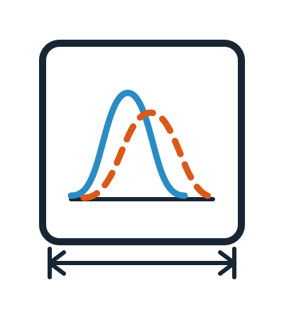

# journalfig

[](https://github.com/Atilaac/journalfig/actions/workflows/ci.yml)
[](https://pypi.org/project/journalfig/)
[](https://pypi.org/project/journalfig/)
[](LICENSE)
[](https://atilaac.github.io/journalfig/)

<p align="center">
  <picture>
    <source media="(prefers-color-scheme: dark)" srcset="docs/assets/logo-inverted.svg">
    
  </picture>
</p>

Publication-ready matplotlib themes for **Nature**, **APS** (PRB/PRL), **Elsevier** (Acta Materialia, JNCS), **IOP**, **AIP**, **ACS**, **RSC**, **IEEE**, **PLOS**, **Wiley**, **PNAS**, and **Science**. Import once, and retarget a figure to a different journal by changing one string.

Every number in the themes is traceable to a publisher document — see [Sources](#sources). Nothing is guessed; the six values that had to be derived are marked `DERIVED` beside the number, four of them unit conversions of figures PLOS publishes in pixels and the other two the APS 1.5- and 2-column widths.

## Install

```bash
pip install journalfig
```

From a checkout, for development:

```bash
uv pip install -e ".[dev]" --python /path/to/your/python
```

Re-run for each environment you want it in.

## Use

```python
import journalfig as jf

jf.use("elsevier")                                     # or "nature", "aps", "PRB", "Acta Materialia"
fig, ax = jf.subplots("elsevier", width="single")      # exact 90 mm, no figsize boilerplate
ax.plot(q, sq, label=r"$S(q)$")
ax.set_xlabel(r"$q$ (Å$^{-1}$)")                       # APS wants units in parentheses
ax.legend()
jf.save(fig, "fig_structure_factor")                   # writes .pdf + .svg + .png
```

Use `jf.subplots(journal, nrows, ncols, width=...)` and `jf.figure(journal, width)` rather than
`plt.subplots(figsize=...)`. They pin the exact size — see the backend note below.

Other entry points:

```python
jf.use("aps", usetex=True)          # real LaTeX instead of mathtext (APS needs matplotlib >= 3.10, see below)
jf.use("elsevier", base_size=9)     # scale the whole theme up
with jf.context("nature"): ...      # temporary; restores previous rcParams
jf.mosaic(journal, "AAB\nCCB")      # panels of different sizes, see below
jf.gridspec(journal, 2, 3)          # the same, as a grid you place panels on yourself
jf.panel_labels(axs)                # a, b, c for Nature; (a), (b), (c) for APS/Elsevier
jf.label_lines(ax)                  # name each curve at its end, instead of a legend box
jf.check(fig)                       # report violations without saving
jf.fonts()                          # which typeface this machine will really draw with
jf.source("aps")                    # the publisher document behind the numbers, and when it was checked
plt.style.use("nature")             # works after `import journalfig`
```

`jf.save` reports the size it wrote through the `journalfig` logger at INFO level rather than printing, so
it stays quiet inside a pipeline. Raise that one logger to see it — a blanket
`logging.basicConfig(level="INFO")` also turns on `fontTools`, which logs a dozen lines per PDF:

```python
import logging
logging.basicConfig(format="%(message)s")
logging.getLogger("journalfig").setLevel(logging.INFO)
```
 Compliance warnings all
use `jf.JournalFigWarning`, so `warnings.filterwarnings("ignore", category=jf.JournalFigWarning)` silences
them without touching anything else.

`jf.figsize(journal, width, ratio=..., height_mm=...)` accepts `"single"`, `"onehalf"`, `"double"`
(plus `"onehalf_wide"` for Nature), or an explicit width in millimetres. Height defaults to the inverse
golden ratio and is clamped to the journal maximum with a warning rather than silently.

## Panels of different sizes

`jf.mosaic` sketches the layout as text: one character per grid cell, repeated where a panel should
span, `.` where it should stay empty. `width_ratios` and `height_ratios` then set how large the
columns and rows are relative to each other, so panels need not be multiples of one cell.

```python
fig, panels = jf.mosaic(
    "nature", "AAB\n"      # a big map on the left, spanning two rows and two columns,
              "AAC\n"      # two small panels stacked beside it,
              "DDD",       # and a wide strip underneath
    width="double", ratio=0.72,
    width_ratios=[1, 1, 1.15], height_ratios=[1, 1, 0.85],
)
panels["A"].imshow(density)
panels["D"].plot(r, gr)
jf.panel_labels(panels)            # a, b, c, d in reading order — pass labels=list(panels) for A, B, C, D
```

`panels` maps each name to its axes, in the order the names first appear reading left to right, top
to bottom, which is the order `jf.panel_labels` letters them. For layouts easier to express as
slices than as a sketch, `jf.gridspec` hands back the figure and an empty grid:

```python
fig, gs = jf.gridspec("aps", 3, 3, width="double", ratio=0.8, height_ratios=[1, 1, 0.6])
main = fig.add_subplot(gs[:2, :2])
side = fig.add_subplot(gs[:2, 2])
strip = fig.add_subplot(gs[2, :])
```

Both size and pin the figure exactly like `jf.subplots`, so `jf.save` and `jf.check` behave the same.
For a plain grid with unequal columns there is no need for either — `jf.subplots` forwards
`width_ratios` / `height_ratios` straight to matplotlib:

```python
fig, axs = jf.subplots("elsevier", 1, 2, width="double", width_ratios=[3, 1])
```

Two things bite in multi-panel figures specifically. **Height still defaults to the golden ratio of
the width**, which is far too short once there is more than one row — pass `ratio=` or `height_mm=`
deliberately. And **`fig.colorbar` reserves `fraction=0.15` of its parent panel's width**, so on a
wide spanning panel it leaves a large gap between the panel and a bar that is sized by its aspect
ratio rather than by that fraction; `fraction=0.05, pad=0.02` is a reasonable starting point there.

## What each theme enforces

| | **Nature** | **APS** (PRB/PRL) | **Elsevier** |
|---|---|---|---|
| single | 89 mm | 3.375 in (8.5 cm) | 90 mm |
| 1.5 column | 120 / 136 mm | 5.3125 in *(derived)* | 140 mm |
| double | 183 mm | 7.0 in *(derived)* | 190 mm |
| max height | 247 mm | — | — |
| font | Arial / Helvetica | Times New Roman | Arial / Helvetica |
| base size | 7 pt | 9 pt | 7 pt |
| text limits | 5–7 pt | lettering ≥ 2 mm | 7 pt, sub ≥ 6 pt |
| panel labels | `a` 8 pt bold | `(a)` 9 pt bold | `(a)` 8 pt bold |
| lines / markers | — | ≥ 0.5 pt / ≥ 1 mm | — |
| `save()` writes | PDF + SVG + PNG | PDF + SVG + PNG | PDF + SVG + PNG |
| accepts as final artwork | PDF | PDF, EPS | PDF, EPS, TIFF, JPEG |
| raster dpi | 300 | 600 | 500 |

APS publishes only the single-column width; the 1.5- and 2-column values are derived from standard REVTeX
two-column geometry (7.0 in text width, 0.25 in gutter) and are the only inferred numbers in the package.

Every theme writes the same three files: the PDF you submit, an SVG to edit in Inkscape or Illustrator, and
a PNG for a talk or a quick look. Anything else is a `formats=` away — `jf.save(fig, path, formats=["tiff"])`
for an Elsevier TIFF, `["pdf", "eps"]` for an APS colour-online-only figure — and the SVG converts to
whatever else a publisher asks for.

The draft warning fires once per call, and only when *nothing* written is a format the publisher takes as
final artwork: a PNG beside a PDF is silent, a PNG on its own is not. SVG keeps live, editable text, so it
renders correctly only where the theme's typeface is installed — `jf.fonts()` tells you what that is.

No theme writes EPS by default. APS documents `.eps` for colour-online-only figures and still accepts it,
but the PostScript backend cannot express transparency: any artist with `alpha < 1` is silently flattened to
opaque, so the EPS stops matching the PDF of the same figure. PDF, SVG, PNG and TIFF all keep it.

A requested TIFF is written LZW-compressed, which takes a single-column Elsevier figure from 7.8 MB to
132 kB with byte-identical pixels. Elsevier recommends TIFF but documents no compression scheme either way, so this is
the package's choice, not theirs — `jf.save(fig, path, pil_kwargs={})` writes it uncompressed.

## Using it in a notebook

Put this once at the top, next to `%matplotlib inline`:

```python
%config InlineBackend.print_figure_kwargs = {"bbox_inches": None}
```

Jupyter crops every inline preview with `bbox_inches="tight"`. That defeats the exact column widths
this package exists to guarantee, and because the themes sit the axes close to the canvas edge, the crop
slices through the top and right spines — they preview at 40% and 20% of their true weight, so the frame
looks lopsided even though the figure is correct. Saved files were never affected: `jf.save()` forces
`bbox_inches=None`.

## Six things worth knowing

**Nature caps text at 7 pt; APS requires ≥ 2 mm lettering, which forces 9 pt.** These are irreconcilable, which is exactly why there is a theme per publisher rather than one. The APS size is not a guess — Times New Roman digits measure 1.94 mm at 8 pt (fails) and 2.18 mm at 9 pt (passes), measured with `TextPath`.

**A missing font is substituted silently, and that is the easiest way to submit a non-compliant figure.** Ask for Arial on a machine that has no Arial and matplotlib draws DejaVu Sans instead — the figure looks fine, and nothing in matplotlib treats it as an error. This bites when you develop on a laptop that has the font and render on a cluster that does not. `jf.check()` reports it as a `font` violation, and `jf.fonts()` shows what each face resolved to:

```python
>>> jf.use("nature"); jf.fonts()["text"]
FontStatus(requested=('Arial', 'Helvetica', ...), resolved='Arial', path='...', status='exact')
```

`status` is `exact` for a face the publisher names, `substitute` for a metrically compatible stand-in (Liberation Sans, Nimbus Sans, Arimo for Arial; STIXGeneral, Nimbus Roman, Liberation Serif for Times), and `fallback` for anything else. Substitutes pass `jf.check()` — they were cut to the same widths, so the layout is identical. On a bare Linux box, `apt install fonts-liberation` is usually the whole fix; the APS theme already lands on matplotlib's bundled STIXGeneral without any install.

**matplotlib shrinks maths sub/superscripts to 0.7×.** A 7 pt Elsevier label renders `$x_a$` at 4.9 pt against a hard 6 pt floor. Use `jf.use("elsevier", base_size=9)` for maths-heavy figures. Nature's case is *unsatisfiable* — 7 pt is their maximum, yet any subscript then falls below their 5 pt minimum. `jf.check()` reports the real rendered size so the decision is yours rather than silent.

**`savefig.bbox="tight"` breaks column widths.** It crops a requested 89 mm figure to 87.9 mm (252.3 → 249.2 pt). The themes use `constrained_layout` with `savefig.bbox="standard"`, and `jf.save()` forces `bbox_inches=None`, so what you ask for is what lands in the file.

**Interactive backends round a new figure to whole device pixels.** On the default macOS backend,
`plt.subplots(figsize=jf.figsize("nature", "double"))` yields 182.88 mm rather than 183.0 mm, because the
canvas snaps 7.2047 in × 150 dpi = 1080.7 px down to 1080 px. `jf.subplots()` / `jf.figure()` re-apply the
size with `forward=False` to skip that round-trip, and `jf.save()` re-asserts it before writing. This is
invisible under `Agg`, so it will not show up in a headless test — it only bites in real use.

**In LaTeX, include theme figures at their natural size.** `\includegraphics[width=\linewidth]{...}` rescales
them and destroys the font sizing: `elsarticle` in `preprint` mode has a 137 mm `\textwidth`, so a 190 mm
double-column figure is scaled by 0.72 and its compliant 7 pt labels land at ~5 pt. Size the figure with
`jf.figsize`/`jf.subplots` and then use a bare `\includegraphics{fig.pdf}`.

### One version caveat

The package supports matplotlib >= 3.8, and CI tests that floor on every push. The exception is
`jf.use("aps", usetex=True)`: its preamble uses `mathptmx` for Times maths, and on matplotlib 3.8 and 3.9
that raises `LookupError: An associated PostScript font ... could not be found for TeX font 'zptmcm7y'` at
save time on TeX installations whose `pdftex.map` has no Type 1 entry for it. matplotlib 3.10 resolves the
same setup without complaint. Nature and Elsevier `usetex` figures are unaffected on all supported versions.

### Keeping vector files sane

`imshow` embeds a bitmap and is never a problem. `pcolormesh` and dense scatters are: they emit one
vector path per cell or point, and a 400x400 mesh lands in a PDF at 3.7 MB. Pass `rasterized=True` to
that one artist and it becomes 108 kB, with the axes, ticks and labels still live vector text.
`jf.check()` reports it when an un-rasterized artist passes `jf.VECTOR_ELEMENT_LIMIT` — the one rule in
the checker that no publisher documents, and the package's own judgement rather than a requirement.

Handing an SVG to someone else? `jf.save(fig, path, formats=["svg"], svg_text="path")` outlines the
glyphs so it renders identically on a machine without your fonts, at the cost of editable text.

## Colours

Okabe–Ito, identical across every theme so retargeting never changes colours. This follows APS's explicit requirement to use accessible palettes and to distinguish curves by line style as well as hue, so figures survive greyscale printing.

```
#0072B2 blue    #D55E00 vermillion   #009E73 green    #CC79A7 purple
#E69F00 orange  #56B4E9 sky          #F0E442 yellow   #000000 black
```

Available as `jf.COLORS` (name → hex) and `jf.COLOR_CYCLE`. The property cycle pairs colour with linestyle only — markers are deliberately left out, since a marker in the cycle would decorate every point of a dense curve. Use `jf.MARKER_CYCLE` when you want them.

## Examples

The [`examples/`](examples/) folder holds eight executed notebooks — readable without running anything.
Each is standalone, uses synthetic data, and labels its axes generically, because they are about how a
figure is built rather than about any particular measurement.

| notebook | covers |
|---|---|
| [`00_getting_started.ipynb`](examples/00_getting_started.ipynb) | themes, exact widths, saving, compliance checking, fonts |
| [`01_line_plots.ipynb`](examples/01_line_plots.ipynb) | the colour/linestyle cycle, greyscale safety, line weights, log axes |
| [`02_scatter_plots.ipynb`](examples/02_scatter_plots.ipynb) | markers, the points-vs-points² trap, error bars |
| [`03_histograms.ipynb`](examples/03_histograms.ipynb) | outlines, shared bins, densities, hatching |
| [`04_heatmaps.ipynb`](examples/04_heatmaps.ipynb) | `imshow`, `pcolormesh`, colormaps, the colorbar trap |
| [`05_multipanel_figures.ipynb`](examples/05_multipanel_figures.ipynb) | `mosaic`, `gridspec`, panel labels, and how to make a grid look deliberate |
| [`06_reading_and_fitting.ipynb`](examples/06_reading_and_fitting.ipynb) | reading a data file from [`examples/data/`](examples/data/), fitting a sinusoid, residual panels |
| [`07_boxplots.ipynb`](examples/07_boxplots.ipynb) | the five-number summary, the two whisker conventions, comparing groups |

## Gallery

```bash
python demo.py     # writes gallery/{nature,aps,elsevier}{,_mosaic}.pdf and .png
```

`*_mosaic` is the unequal-panel layout above; the other is a plain 2x2 grid.

## Development

```bash
pytest -q                                  # tests/ plus every docstring Example: block, run as doctests
pytest tests/test_journalfig.py -x -k mosaic
ruff check src/ tests/ demo.py
mkdocs serve                               # live docs preview
```

CI runs the suite on Linux, macOS, and Windows across Python 3.12–3.14, with no journal typeface installed
on the runners — the package has to behave on a bare machine, which is the situation an HPC user is in.
See [CONTRIBUTING.md](CONTRIBUTING.md) for what a change needs, particularly for anything numeric.

## Citing

If this package contributed to a published figure, cite it via [CITATION.cff](CITATION.cff) — GitHub's
"Cite this repository" button renders it as BibTeX.

## Sources

- [Nature, *Guide to Preparing Final Artwork*](https://www.nature.com/documents/nature-final-artwork.pdf) — retrieved 2026-07-28
- [APS Journals Style Guide for Authors (Nov 2024)](https://res.cloudinary.com/apsphysics/image/upload/v1715884920/aps-journals-style-guide_tnoyln.pdf), §S "Figures" — retrieved 2026-07-28
- [Elsevier, *Artwork sizing*](https://www.elsevier.com/about/policies-and-standards/author/artwork-and-media-instructions/artwork-sizing) — retrieved 2026-07-28
- [Elsevier, *Artwork formats checklist*](https://www.elsevier.com/about/policies-and-standards/author/artwork-and-media-instructions/artwork-formats-checklist) — accepted file formats, retrieved 2026-08-05
- [PRB Information for Contributors](https://journals.aps.org/prb/info/infoB.html)

Publishers revise these without notice, so `jf.source(journal)` carries the retrieval date in the package
itself. If a value has gone stale, please
[open a specification correction](https://github.com/Atilaac/journalfig/issues/new?template=spec_correction.yml).
